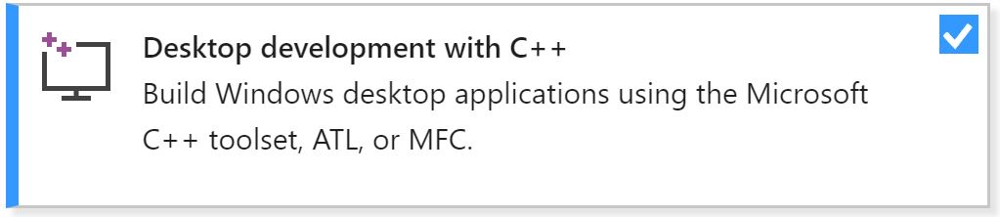

# Facial Tracking Workshop Setup Instructions
Stores all instructions and source files for facial tracking workshop

## Installing and Setting Up Virtual Environements
### Windows
#### Install Visual Studio 2017
* When the Installer opens, **MAKE SURE TO INSTALL "DESKTOP DEVELOPMENT WITH C++"** (You'll know if you are going to install it if there is a check mark in the little box [see below])  

#### Install Python 3 (If you do not have Python3.4+; else, skip this step)
* Go to the link and install the newest release of Python: https://www.python.org/downloads/windows/
#### Install git
* Go to this link and the download should start immediately: http://git-scm.com/download/win
#### Create directory heirarchy & Clone the git repository
* Open Windows Powershell (the blue one)
* Navigate to the Documents directory (folder) on your PC by executing the following command:  
  ```
  cd ~\Documents  
  ```
* Clone this repository into that directory with the following commands:
  ``` 
  git clone [URL for this repository goes here]  
  ```
  &nbsp;&nbsp;&nbsp;**M**&nbsp;&nbsp;&nbsp;**E**&nbsp;&nbsp;&nbsp;**T**&nbsp;&nbsp;&nbsp;**A**  
  &nbsp;&nbsp;&nbsp;**E**  
  &nbsp;&nbsp;&nbsp;**T**  
  &nbsp;&nbsp;&nbsp;**A**  
#### Install Virtual Environment Packages
* Close Powershell
* Open Powershell **AS ADMINISTRATOR**
* Run the following command:
  ```
  python -m pip install virtualenv
  python -m pip install virtualenvwrapper-win
  ```
  * NOTE: This step might take some trial and error; this just depends on packages you've already installed and your admin permissions
* Close Powershell
* Open Command Prompt
* Navigate to `C:\Users\[your user name here]\Documents` (where we cloned the github repository)
* Navigate into the cloned repository with `cd facial_tracking_workshop\Resources`
* Let's create a virtual environment called `facial_tracking` with the following command:
  ```
  mkvirtualenv facial_tracking -r requirements.txt
  ```
* After the virtual environment has been created (this might take a _hot_ second), look for the name of our virtual environment ("facial_tracking") to appear in parentheses at the very left of the terminal prompt line:
  ```
  (facial_tracking) C:\Users\[your user name here]\Documents\facial_tracking_workshop\Resources
  ```
* If this shows up, **YOU DID IT**
* If not, it's ok, just ask a PI for help!
  * NOTE: I had some trouble getting Windows to actually install with the correct packages. If you are using Windows, **have a PI come and make sure you have the correct packages installed. If you do not, we will have to install them "by hand"**

### MacOS
#### Install Python 3 (If you don't already have version 3.4+)
* Check what version by opening the Terminal and running `python3 --version`
* If the above step does not work, you don't have Python 3
* Go to this link and download the 32bit/64bit installer for Python 3.6.8: https://www.python.org/downloads/mac-osx/
#### Install git
* Open the Terminal
* Run the following command: `git --version`
  * If you have git installed already, it will tell you the version
  * If not, it will prompt you to install git. Follow the instructions to do this
#### Create directory heirarchy & Clone the git repository
* Navigate to the Documents directory (folder) on your Mac by executing the following command:  
  ```
  cd ~/Documents  
  ```
* Clone this repo into that directory with the following commands:
  ``` 
  git clone [URL for this repository goes here]  
  ```
  &nbsp;&nbsp;&nbsp;**M**&nbsp;&nbsp;&nbsp;**E**&nbsp;&nbsp;&nbsp;**T**&nbsp;&nbsp;&nbsp;**A**  
  &nbsp;&nbsp;&nbsp;**E**  
  &nbsp;&nbsp;&nbsp;**T**  
  &nbsp;&nbsp;&nbsp;**A**  
#### Install pip
* Go to the Terminal
* type the following command: `sudo easy_install pip`
  * If you have pip installed already, this will tell you; otherwise, it will install it
#### Install Virtual Environment Packages
* Run the following command:
  ```
  sudo pip install virtualenv virtualenvwrapper
  ```
  * NOTE: This step might take some trial and error; this just depends on packages you've already installed and your admin permissions
#### Setup the Virtual Environment Path
* Navigate to your home directory with the following command: `cd ~`
* See if you have a `.bash_profile` file
  * Do this by executing the following command:
    ```
    ls
    ```
  * Look at the output and see if you have the file
  * If you DO NOT have this file, create it with the following command (otherwise, skip to the next step):
    ```
    touch .bash_profile
    ```
* Let's edit this file with the following command:
  ```
  nano .bash_profile
  ```
* Add the following lines to the file after everything else (if the file is empty, this will be the only thing to add):
  ```
  export WORKON_HOME=~/virtualenvs
  source /usr/local/bin/virtualenvwrapper.sh
  ```
* Type CTRL+O and hit ENTER to save the changes
* Type CTRL+X to exit nano
* Execute the following command (This only has to be done once):
  ```
  source ~/.bash_profile
  ```
* You should see a bunch of stuff print out to the terminal. You have now successfully setup your ability to create virtual environments in Python!
* Navigate to `~/Documents` (where we cloned the github repository)
* Navigate into the cloned repository with `cd facial_tracking_workshop/Resources`
* Let's create a virtual environment called `facial_tracking` with the following command:
  ```
  mkvirtualenv facial_tracking -r requirements.txt
  ```
* After the virtual environment has been created (this might take a _hot_ second), look for the name of our virtual environment ("facial_tracking") to appear in parentheses at the very left of the terminal prompt line:
  ```
  (facial_tracking) DWheezys_Mac_Book:Resources DWheezy$
  ```
* If this shows up, **YOU DID IT**
* If not, it's ok, just ask a PI for help!

### Linux (Ubuntu)
#### Install Python 3 (If you don't already have version 3.4+)
* Check what version by opening the Terminal and running `python3 --version`
* If the above step does not work, you don't have Python 3
* Install with the following command:
  ```
  sudo apt-get update
  sudo apt-get install python3.6
  ```
#### Install git
* Open the Terminal
* Run the following command: `git --version`
  * If you have git installed already, it will tell you the version
  * If not, install git with the following command:
    ```
    sudo apt-get install git
    ```
#### Create directory heirarchy & Clone the git repository
* Navigate to the Documents directory (folder) on your Mac by executing the following command:  
  ```
  cd ~/Documents  
  ```
* Clone this repo into that directory with the following commands:
  ``` 
  git clone [URL for this repository goes here]  
  ```
  &nbsp;&nbsp;&nbsp;**M**&nbsp;&nbsp;&nbsp;**E**&nbsp;&nbsp;&nbsp;**T**&nbsp;&nbsp;&nbsp;**A**  
  &nbsp;&nbsp;&nbsp;**E**  
  &nbsp;&nbsp;&nbsp;**T**  
  &nbsp;&nbsp;&nbsp;**A**  
#### Install pip
* Go to the Terminal
* type the following command: `sudo apt-get install pip`
  * If you have pip installed already, this will tell you; otherwise, it will install it
#### Install Virtual Environment Packages
* Run the following command:
  ```
  sudo pip install virtualenv virtualenvwrapper
  ```
  * NOTE: This step might take some trial and error; this just depends on packages you've already installed and your admin permissions
#### Setup the Virtual Environment Path
* Navigate to your home directory with the following command: `cd ~`
* Let's edit the `.bashrc` file with the following command:
  ```
  nano .bashrc
  ```
* Add the following lines to the file after everything else (if the file is empty, this will be the only thing to add):
  ```
  export WORKON_HOME=~/virtualenvs
  source /usr/local/bin/virtualenvwrapper.sh
  ```
* Type CTRL+O and hit ENTER to save the changes
* Type CTRL+X to exit nano
* Execute the following command (This only has to be done once):
  ```
  source ~/.bashrc
  ```
* You should see a bunch of stuff print out to the terminal. You have now successfully setup your ability to create virtual environments in Python!
* Navigate to `~/Documents` (where we cloned the github repository)
* Navigate into the cloned repository with `cd facial_tracking_workshop`
* Let's create a virtual environment called `facial_tracking` with the following command:
  ```
  mkvirtualenv -p python3 facial_tracking -r requirements.txt
  ```
* After the virtual environment has been created (this might take a _hot_ second), look for the name of our virtual environment ("facial_tracking") to appear in parentheses at the very left of the terminal prompt line:
  ```
  (facial_tracking) dwheezy@computer:~/Documents/facial_tracking_workshop/Resources$
  ```
* If this shows up, **YOU DID IT**
* If not, it's ok, just ask a PI for help!

